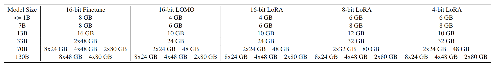

# No More Complications, Effortless LLM Training with **Lingo**🚀🚀

<p align="center">
    
    
    
    
</p>
<div align="center">

</div>

Welcome to the Lingo Project - Lingo is an open-source system that enables easy and efficient training of large language models (LLMs) through a simple command-line interface, without requiring any coding experience. The key goal of Lingo is to make LLM training more accessible by abstracting away unnecessary complexity. 🚀🚅

### 🔄 Recent updates
* [2023/07/27] Release **Lingo-v1.2.0** ! Lingo integrates model parallelism, quantization, parameter efficient fine-tuning (PEFT), memory efficient fine-tuning (MEFT), ZeRO optimization, custom dataset loading, and position interpolation.
* [2023/06/30] Release [Lingo-dataset-v1](https://huggingface.co/datasets/WENGSYX/Lingo-dataset-v1) On the basis of the LIMA dataset, we manually translated it into Chinese QA and adapted it in multiple places to adapt to the Chinese environment. 
* [2023/06/01] We have created the Lingo project, and we hope that everyone can train LLM on consumer-level servers.
### How to install
This repository is tested on Python 3.8+, PyTorch 1.10+ and Deepspeed 0.9.3+, detail in [Install](https://wengsyx.github.io/Lingo/install.html).
```
git clone https://github.com/WENGSYX/Lingo
pip install .
```

### Quick tour
To quickly train models using Lingo, simply use `Let_Lingo()`. By calling OpenAI's GPT-4, you can determine various parameters for the model you wish to train. Finally, Lingo will save the configuration as `ARGS.json`.
```python
from lingo import Let_Lingo
Let_Lingo()

>>> [INFO] This is a library for training language models with ease. 
>>> [INFO] In conversations with Lingo, the language model will be trained automatically according to your needs, without requiring any effort on your part 😊
>>> [INFO] Would you like to command Lingo through casual conversation? 
>>> [Answer] If yes, please type (Yes), let"s go~, If not, please type (No): yes

>>> [AI] Hello there! I"m your AI assistant, and I"m here to help you train your model. Before we get started, it"s important to have a clear plan and goal in mind. 
>>> [Answer] :
```
If GPT-4 is not available, we have also configured ten questionnaire-style questions. By answering these questions, you can successfully configure the system as well.

##### Continue training
If training is stopped halfway, you can quickly restart the training process without repeating the training by using the following code. Alternatively, you can try other training methods more quickly by manually modifying the parameters in `ARGS.json`.
```python
from lingo import Let_Lingo

Let_Lingo('./ARGS.json')
```


### Create your characteristic dataset

```python
from lingo.dataset import LingoDataset

dataset = LingoDataset()
# Give your model a name
dataset.set_model_name('Cognitive Intelligence Model')
# Add QA dataset samples
dataset.add_sample(['Who are you?',
                    "Hello everyone! I am a great artificial intelligence assistant, a cognitive intelligence model, created by the Language and Knowledge Computing Research Group of the Institute of Automation, Chinese Academy of Sciences. I am like your personal assistant, able to chat with you in fluent natural language. Whether it's answering questions or providing assistance, I can easily handle it. Although I don't have a physical image, I will do my best to provide you with the most thoughtful service"])
```

We have manually translated the LIMA dataset into Chinese Q&A, and rewrote it in many places to adapt to the Chinese
environment. In addition, we have added 100 high-quality Chinese dialogue materials written by us.

- We have built-in dozens of samples with model names, and by simply calling `lingo_dataset.set_model_name`, you can
  update the model name for all samples with one click.
- We support adding new samples. Call `lingo_dataset.add_sample` and pass in a dialogue list to automatically add new
  dialogue samples.
- Get the dataset with one click. Calling `lingo_dataset.get_list()` will return a list-format dataset, and you can
  continue to train new models on this basis.

### Supported Models
|                      | LoRA | QLoRA | LOMO | Model Parallelism | Position Interpolation |Model Size |
|----------------------|-----------------|------------|------------|----------------|---------------------|------------|
GPT-2:|✅|✅|✅|                |                     |117M|
GPT-Neo-1.3B|✅|✅|✅|                |                   | 1.3B              |
ChatGLM-6B|✅|✅|✅|                |                     |6B|
ChatGLM2-6B|✅|✅|✅|                |                     |6B|
Llama-7B|✅|✅|✅|                | ✅                   |7B|
Llama-13B|✅|✅|✅| ✅              | ✅                   |13B|
Llama-33B|✅|✅|✅| ✅              | ✅                   |33B|
Llama-65B|✅|✅|✅| ✅              | ✅                   |65B|
Llama2-7B|✅|✅|✅|                | ✅                   |7B|
Llama2-13B|✅|✅|✅| ✅              | ✅                   |13B|
Llama2-70B|✅|✅|✅| ✅              | ✅                   |70B|
GLM-130B|✅|✅|✅| ✅              |                     |130B|


### GPU Memory 
<center>

</center>

### Compared to others
|                      | Model Parallelism | Quantization | PEFT | MEFT | ZeRO | Load Dataset | Position Interpolation | AI Assisstent | Code Concise |
|----------------------|-------------------|--------------|------|------|------|--------------|------------------------|---------------|--------------|
| MegatronLM           | ✅                |              |      |      |      |              |                        |               |              |
| Huggingface          | ✅                |              | ✅   |      | ✅   | ✅           |                        |               | ✅           |
| bitsandbytes         |                   | ✅           |      |      |      |              |                        |               |              |
| Lamini               |                   |              |      |      |      | ✅           |                        |               | ✅           |
| OpenDelta            |                   |              | ✅   |      |      |              |                        |               | ✅           |
| h2oGPT              |                   | ✅           | ✅   |      |      | ✅           |                        |               | ✅           |
| **Lingo (Ours)**    | ✅                | ✅           | ✅   | ✅   | ✅   | ✅           | ✅                      | ✅             | ✅           |

### Cite

This project is an accompanying project of [Neural Comprehension](https://github.com/WENGSYX/Neural-Comprehension). If you are interested in our project, please feel free
to quote.

```
@misc{weng2023mastering,
      title={Mastering Symbolic Operations: Augmenting Language Models with Compiled Neural Networks}, 
      author={Yixuan Weng and Minjun Zhu and Fei Xia and Bin Li and Shizhu He and Kang Liu and Jun Zhao},
      year={2023},
      eprint={2304.01665},
      archivePrefix={arXiv},
      primaryClass={cs.CL}
}
```
