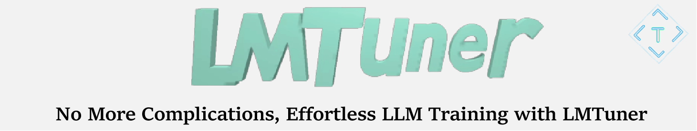

# 轻松无忧 LLMs 训练，**LMTuner**来了🚀🚀

<p align="center">
  
  
  
  
</p>
<h4 align="center">
    <p>
        <a href="https://wengsyx.github.io/LMTuner/">Homepage</a> |
        <a href="https://github.com/WENGSYX/LMTuner/blob/main/Readme.md">Code</a> |
        <a href="https://arxiv.org/abs/2308.10252">Paper</a> |
        <a href="https://wengsyx.github.io/LMTuner/install.html">Install</a> |
        <b>中文简体</b>
    <p>
</h4>
<div align="center">

</div>

欢迎来到 LMTuner 项目 - LMTuner 是一个开源系统,通过简单的命令行界面让大语言模型(LLM)的训练变得简单高效,无需任何编码经验。LMTuner 的关键目标是通过抽象掉不必要的复杂性,使 LLM 训练更具可访问性。🚀🚅

### 🔄 最新动态
* [2023/08/22] 我们发布了LMTuner的[官方论文](https://arxiv.org/abs/2308.10252)，并发布 **LMTuner-v1.2.2**! 
* [2023/07/27] 发布 **LMTuner-v1.2.0**! LMTuner 集成了模型并行、量化、参数高效微调(PEFT)、内存高效微调(MEFT)、ZeRO 优化、自定义数据集加载以及位置插值等功能。
* [2023/06/30] 发布 [LMTuner-dataset-v1](https://huggingface.co/datasets/WENGSYX/LMTuner-dataset-v1) 在 LIMA 数据集的基础上,我们手动将其翻译成中文问答,并在多个地方进行了改编以适应中文环境。
* [2023/06/01] 我们创建了 LMTuner 项目,希望大家都可以在消费级服务器上训练 LLM。

### 如何安装

本仓库在 Python 3.8+、PyTorch 1.10+ 和 Deepspeed 0.9.3+ 上测试通过。

```
git clone https://github.com/WENGSYX/LMTuner
pip install .
```

### 快速体验

要快速使用 LMTuner 训练模型,只需使用 `Let_Tune()`。通过调用 OpenAI 的 GPT-4,您可以确定要训练的模型的各种参数。最后,LMTuner 会将配置保存为 `ARGS.json`。

```python
from LMTuner import Let_Tune
Let_Tune()

[INFO] This is a library for training language models with ease. 
[INFO] In conversations with LMTuner, the language model will be trained automatically according to your needs, without requiring any effort on your part 😊
[INFO] Would you like to command LMTuner through casual conversation? 
[Answer] If yes, please type (Yes), let"s go~, If not, please type (No): yes

[AI] Hello there! I"m your AI assistant, and I"m here to help you train your model. Before we get started, it"s important to have a clear plan and goal in mind. 
[Answer] : 我想要训练一个医疗领域的大模型

(AI] 好的，我们可以帮您选择医疗领域的大模型进行训练。首先，请问您打算使用我们提供的现有数据集 Ling-Hedical-V1，还是您有自己的数据集呢? 
[Answer] : 我想用自己的数据集

[AI] 好的，请将您的数据集配置为JSONL文件格式，然后将文件路径赋值给data字段，如果您不清楚如何配置，我可以为您解释。
[AI] JSON 是一种简单的文件格式，灵活且方便处理大型教据集。在您的教据集中，每一行应该是一个独立的字典，字典的键为"input和"output"，例:{'input': "What is hypertension","output": "Hypertension, also known as high blood pressure, is a medical condition in which the force of blood against the walls of the arteries is consistently elevated, leading to increased pressure. This can cause damage to the blood vessels and organs throughout the body over time."
[AI] 然后，您可以将数据集文件的绝对路径粘贴在这里，我会为您将它配置到模型训练中。
[Answer] : /data/LLM/LMTuner/data.jsonl

[AI] 已经将您的数据集路径设置为"/data/LLM/LMTuner/data.jsonl"。接下来，我们需要为您的任务选择一个语言模型。模型的选择主要基于您的数据语言和显卡的显存。
[AI] 考虑到您想要训练医疗领域的大模型，我推荐使用以下模型: GLM-130B，Llama-13b，Llama-33b，或者Llama-65b。您的显卡的显存和数量如何?对于不同显存，建议的模型和训练方法有一些差别。
[AI] 您能方便告诉我你的显卡显存和数量吗? 这样我可以更准确地为您推荐模型和训练方法。
[Answer] : 我的服务器，现在有4张A6000显卡

[AI] 了解了，您的服务器上有4张A6000显卡，每张显卡的显存都是48GB。
[AI] 在这种配置下，您可以选择一些比较大的模型进行训练。例如，可以选择 130B 的模型，使用QLORA的方式来进行训练
[AI] 如果您对使用其他模型或训练方式有偏好，也可以告诉我，我们可以根据您的需要进行设定·您希望使用哪种模型进行训练呢?
[Answer] : 可以的

[AI] 已为您选择了GLH-130B模型进行训练。下一步，我们需要确定训练的方法。在当前的情况下，我建议使用LORA方法进行训练，QLORA方法仅微调模型的部分参数，可以建低显卡显存的要求，是最适合训练大植型的一种方法。如果您选择QLoRA训练方式，那我们推荐使用INT量化以优化显存。您是否同意使用QLoRA方法以及INT4量化？
[Answer] : 同意

...
(自动填写ds_config并调用Deepspeed使用QLoRA+GLM-130B训练模型)
```

如果 GPT-4 不可用,我们还配置了十个类似问答的问题。通过回答这些问题,您也可以成功配置系统。

##### 继续训练

如果训练中途停止,您可以通过以下代码快速重新启动训练过程,而无需重复训练。或者,您可以通过手动修改 `ARGS.json` 中的参数更快地尝试其他训练方法。

```python
from LMTuner import Let_Tune

Let_Tune('./ARGS.json')
```


### 创建你的特色数据集
我们还允许创建特色数据集，包括添加新的样本和指定模型名称等。
```python
from LMTuner.dataset import LMTunerDataset

LMTuner_dataset = LMTunerDataset()
# 给你的模型取一个名字
LMTuner_dataset.set_model_name('认知智能大模型')
# 增加问答数据集样本
LMTuner_dataset.add_sample(['你是谁？',
                          '大家好！我是一个超级棒的人工智能助手，认知智能大模型。我就像你的私人小助手，能用流利的自然语言和你聊天，无论是解答问题还是提供帮助，我都能轻松搞定。虽然我没有实体形象，但我会竭尽所能，为你提供最贴心的服务哦！'])

# 获得列表格式数据集
dataset = LMTuner_dataset.get_list()
```

我们在[LIMA](https://huggingface.co/datasets/GAIR/lima)数据集的基础上人工翻译为中文问答，并在多处进行改写以适应中文环境，另外加入了一百条我们编写的高质量中文对话语料。

- 我们内置了数十条包含模型名字的样本，通过简单调用 `LMTuner_dataset.set_model_name`就可以一键为所有样本更新模型名字
- 我们支持额外添加新的样本，调用 `LMTuner_dataset.add_sample`并传入对话列表，即可自动加入新的对话样本。
- 一键获得数据集，调用 `LMTuner_dataset.get_list()`将返回列表格式的数据集，您可以在此基础上继续训练新的模型

### Example
我们准备了一个使用Llama-7B在英文医疗问答数据集上训练的[例子](https://github.com/WENGSYX/LMTuner/tree/main/Example/English_Medical)

### 支持的模型

|                      | LoRA | QLoRA | LOMO | 模型并行 | 位置插值 | 模型规模 |
|----------------------|-----------------|------------|------------|----------------|---------------------|------------|
GPT-2:|✅|✅|✅|                |                     |117M|
GPT-Neo-1.3B|✅|✅|✅|                |                   | 1.3B              |
ChatGLM-6B|✅|✅|✅|                |                     |6B|
ChatGLM2-6B|✅|✅|✅|                |                     |6B|  
Llama-7B|✅|✅|✅|                | ✅                   |7B|
Llama-13B|✅|✅|✅| ✅              | ✅                   |13B|
Llama-33B|✅|✅|✅| ✅              | ✅                   |33B|
Llama-65B|✅|✅|✅| ✅              | ✅                   |65B|
Llama2-7B|✅|✅|✅|                | ✅                   |7B|
Llama2-13B|✅|✅|✅| ✅              | ✅                   |13B|   
Llama2-70B|✅|✅|✅| ✅              | ✅                   |70B|
GLM-130B|✅|✅|✅| ✅              |                     |130B|


### GPU 内存 

<center>

</center>

### 与其他方案的比较

|                     | 模型并行 | 量化 | PEFT | MEFT | ZeRO | 载入数据集 | 位置插值 | AI助手 | 代码简洁 |  
|---------------------|-------------------|--------------|------|------|------|--------------|------------------------|---------------|--------------|
| MegatronLM          | ✅                |              |      |      |      |              |                        |               |              |
| Huggingface         | ✅                |              | ✅   |      | ✅   | ✅           |                        |               | ✅           |
| bitsandbytes        |                   | ✅           |      |      |      |              |                        |               |              |  
| Lamini              |                   |              |      |      |      | ✅           |                        |               | ✅           |
| OpenDelta           |                   |              | ✅   |      |      |              |                        |               | ✅           |
| h2oGPT              |                   | ✅           | ✅   |      |      | ✅           |                        |               | ✅           |
| **LMTuner**  | ✅                | ✅           | ✅   | ✅   | ✅   | ✅           | ✅                      | ✅             | ✅           |

### 引用

如果您对我们的项目感兴趣，欢迎引用。

```
@misc{weng2023mastering,
      title={Mastering Symbolic Operations: Augmenting Language Models with Compiled Neural Networks}, 
      author={Yixuan Weng and Minjun Zhu and Fei Xia and Bin Li and Shizhu He and Kang Liu and Jun Zhao},
      year={2023},
      eprint={2304.01665},
      archivePrefix={arXiv},
      primaryClass={cs.CL}
}

@misc{weng2023lmtuner,
      title={LMTuner: An user-friendly and highly-integrable Training Framework for fine-tuning Large Language Models}, 
      author={Yixuan Weng and Zhiqi Wang and Huanxuan Liao and Shizhu He and Shengping Liu and Kang Liu and Jun Zhao},
      year={2023},
      eprint={2308.10252},
      archivePrefix={arXiv},
      primaryClass={cs.CL}
}
```